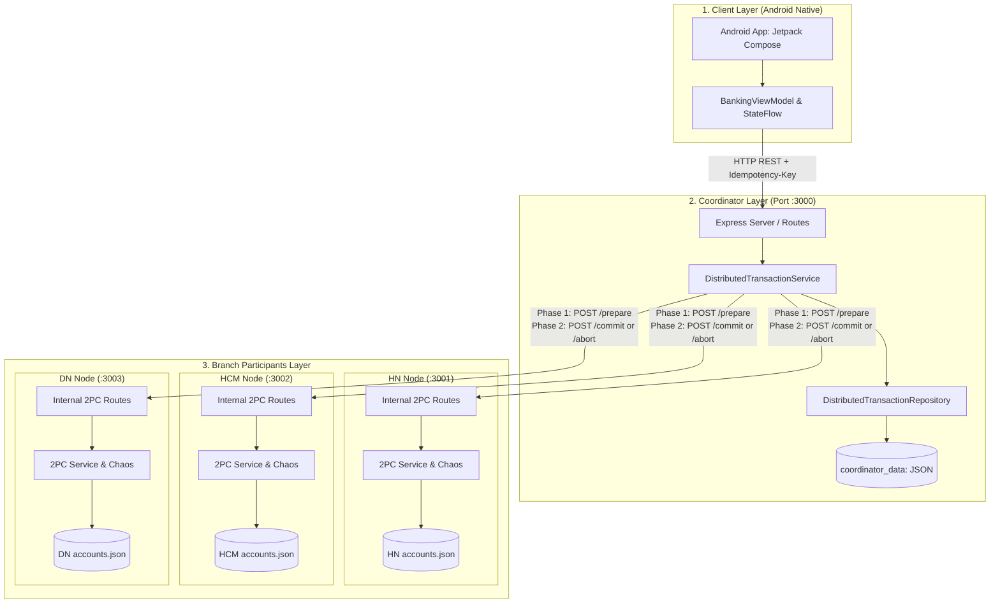

# BÁO CÁO KỸ THUẬT VÀ HỌC THUẬT HỆ THỐNG PHÂN TÁN
## ĐỀ TÀI: DIGITAL BANKING — CHUYỂN TIỀN LIÊN CHI NHÁNH (DISTRIBUTED 2-PHASE COMMIT)

> **Loại tài liệu**: Living Technical & Academic Report  
> **Môn học**: Ứng dụng & Hệ thống phân tán (Distributed Systems)  
> **Phiên bản tài liệu**: `v1.0.0` (Cập nhật dựa trên kiểm tra mã nguồn thực tế)  
> **Thời điểm xác minh**: Tháng 09/2026  
> **Quy ước trạng thái tính năng**:
> - `PLANNED`: Đang trong kế hoạch, chưa có code.
> - `IN PROGRESS`: Đang viết dở, chưa tích hợp hoàn chỉnh.
> - `PARTIAL`: Đã có một phần code nhưng còn thiếu các trường hợp biên.
> - `IMPLEMENTED`: Đã triển khai đầy đủ logic trong mã nguồn.
> - `TESTED`: Đã có kịch bản test/script kiểm thử tự động hoặc bán tự động.
> - `VERIFIED`: Đã chạy thực nghiệm, kiểm chứng bằng chứng thực tế (logs/kết quả test).

---

## MỤC LỤC
1. [Tổng quan dự án](#1-tổng-quan-dự-án)
2. [Bài toán cần giải quyết & Cơ sở lý thuyết](#2-bài-toán-cần-giải-quyết--cơ-sở-lý-thuyết)
3. [Kiến trúc hệ thống thực tế](#3-kiến-trúc-hệ-thống-thực-tế)
4. [Cơ chế bảo toàn tiền tệ & Quản lý số dư](#4-cơ-chế-bảo-toàn-tiền-tệ--quản-lý-số-dư)
5. [Theory → Implementation → Evidence → Limitation](#5-theory--implementation--evidence--limitation)
6. [Failure Matrix (Ma trận sự cố & phục hồi)](#6-failure-matrix)
7. [Distributed System Feature Coverage Matrix](#7-distributed-system-feature-coverage-matrix)
8. [Hiện trạng triển khai tính năng thực tế](#8-hiện-trạng-triển-khai-tính-năng-thực-tế)
9. [Hướng phát triển & Khuyến nghị nâng cấp](#9-hướng-phát-triển--khuyến-nghị-nâng-cấp)

---

# 1. Tổng quan dự án

### 1.1. Thông tin cơ bản
- **Tên dự án**: Digital Banking — Mô phỏng chuyển tiền liên chi nhánh bằng giao thức đồng thuận phân tán.
- **Chủ đề nghiên cứu**: Hệ thống phân tán (Distributed Systems), Tính nhất quán giao dịch (Distributed Transaction Consistency), Khả năng chịu lỗi (Fault Tolerance) và Phục hồi sau sự cố (Crash Recovery).
- **Phạm vi hệ thống**:
  - **1 Client di động (Mobile App)**: Viết bằng Android Native (Kotlin + Jetpack Compose).
  - **1 Bộ điều phối trung tâm (Transaction Coordinator)**: Đóng vai trò tiếp nhận, định tuyến và điều phối giao dịch phân tán (cổng `:3000`).
  - **3 Nút chi nhánh độc lập (Branch Participant Nodes)**:
    - **Chi nhánh Hà Nội (HN Node)**: Quản lý các tài khoản đầu `HN-*` (cổng `:3001`).
    - **Chi nhánh TP. Hồ Chí Minh (HCM Node)**: Quản lý các tài khoản đầu `HCM-*` (cổng `:3002`).
    - **Chi nhánh Đà Nẵng (DN Node)**: Quản lý các tài khoản đầu `DN-*` (cổng `:3003`).

### 1.2. Đặt vấn đề & Ý nghĩa học thuật
Dự án **không** đơn thuần là một ứng dụng CRUD ngân hàng thông thường (vốn chỉ tương tác với 1 cơ sở dữ liệu tập trung). Trong thực tế các hệ thống ngân hàng đa quốc gia hoặc ngân hàng liên chi nhánh, dữ liệu tài khoản được **phân mảnh (Data Sharding/Partitioning)** tại các máy chủ độc lập về địa lý, mạng và quyền quản trị. 

Khi một khách hàng tại Hà Nội chuyển tiền cho một khách hàng tại TP.HCM, giao dịch buộc phải tương tác đồng thời với 2 hệ thống độc lập qua mạng truyền thông. Bài toán này bộc lộ toàn bộ những thách thức cốt lõi nhất của Hệ thống phân tán:

```
DATA DISTRIBUTION (Dữ liệu phân mảnh theo chi nhánh)
        ↓
MULTIPLE NODES (Các máy chủ/tiến trình hoạt động độc lập)
        ↓
NETWORK COMMUNICATION (Giao tiếp qua HTTP/REST tiềm ẩn độ trễ & mất gói)
        ↓
PARTIAL FAILURE (Một chi nhánh sập hoặc timeout trong khi chi nhánh kia vẫn chạy)
        ↓
DISTRIBUTED COORDINATION (Cần bộ điều phối tập trung hoặc đồng thuận ngang hàng)
        ↓
2-PHASE COMMIT (Giao thức 2 pha: Chuẩn bị/Bỏ phiếu → Quyết định Cam kết/Hủy bỏ)
        ↓
FAILURE HANDLING (Xử lý khi Reject, Timeout, Crash ở từng giai đoạn)
        ↓
RECOVERY (Quét nhật ký và phục hồi giao dịch dang dở khi khởi động lại)
        ↓
CONSISTENCY (Đạt tính nhất quán dữ liệu cuối cùng trên toàn mạng)
        ↓
MONEY CONSERVATION (Bảo toàn tổng tài sản: Không tự sinh ra và không tự mất đi)
```

Việc lựa chọn bài toán "Chuyển tiền liên chi nhánh" là kịch bản hoàn hảo nhất để chứng minh:
1. **Sự thất bại của các giả định sai lầm về mạng phân tán (Fallacies of Distributed Computing)**: Mạng không đáng tin cậy, độ trễ khác 0, và các nút có thể gặp lỗi bất kỳ lúc nào.
2. **Sự cần thiết của Atomic Commit Protocols**: Đảm bảo nguyên lý All-or-Nothing trên nhiều ranh giới lưu trữ dữ liệu.

---

# 2. Bài toán cần giải quyết & Cơ sở lý thuyết

### 2.1. Phân vùng dữ liệu (Data Partitioning) theo chi nhánh
- Mỗi nút chi nhánh (`HN`, `HCM`, `DN`) làm chủ hoàn toàn dữ liệu tài khoản của mình thông qua file lưu trữ riêng biệt (`nodes/{branch}/data/accounts.json`).
- **Nguyên tắc cô lập**: Nút HN tuyệt đối không có quyền kết nối trực tiếp hoặc ghi đè vào tệp dữ liệu của Nút HCM. Mọi tương tác trao đổi giá trị bắt buộc phải thông qua API giao tiếp mạng.

### 2.2. Giao dịch nội chi nhánh (Intra-branch) vs. Giao dịch liên chi nhánh (Cross-branch)
- **Giao dịch nội chi nhánh (Same-branch)**: Ví dụ `HN-001` chuyển cho `HN-002`.
  - Điều phối viên (Coordinator) nhận diện cùng `sourceBranchId == destinationBranchId`, lập tức chuyển tiếp (proxy) yêu cầu về thẳng Nút HN.
  - Nút HN tự giải quyết nội bộ trong phạm vi một giao dịch cục bộ (Local Transaction).
- **Giao dịch liên chi nhánh (Cross-branch)**: Ví dụ `HN-001` chuyển cho `HCM-001`.
  - Không một nút đơn lẻ nào có toàn quyền thực thi.
  - Phải kích hoạt một **Distributed Transaction** do Coordinator quản lý, tuân theo giao thức Two-Phase Commit (2PC).

### 2.3. Vì sao không thể "Debit nguồn trước rồi Credit đích sau" một cách ngây thơ?
Giả sử hệ thống thực hiện chuyển tiền tuần tự không có điều phối 2 pha:
1. **Kịch bản Tiền bốc hơi (Money Lost)**:
   - Bước 1: Trừ tiền thành công tại `HN-001` (Debit).
   - Bước 2: Gửi request cộng tiền sang `HCM-001` (Credit). Đúng lúc này, đường truyền mạng đứt, hoặc Nút HCM bị crash, hoặc tài khoản `HCM-001` bị khóa (INACTIVE).
   - Kết quả: Tiền của tài khoản nguồn đã mất, nhưng tài khoản đích không nhận được. Tổng tiền của hệ thống bị suy giảm!
2. **Kịch bản Tiền nhân bản (Money Created / Double Spending)**:
   - Nếu chọn cộng tiền ở `HCM-001` trước rồi mới trừ ở `HN-001`.
   - Khi tài khoản `HN-001` không đủ tiền hoặc bị sập mạng trước khi trừ, hệ thống đã cộng tiền khống cho tài khoản nhận.
3. **Giải pháp 2PC**:
   - Tách quá trình thành 2 giai đoạn rõ rệt: **Phase 1 (Prepare / Vote)** để kiểm tra và phong tỏa tài nguyên, và **Phase 2 (Commit / Abort)** để thực thi dứt điểm quyết định toàn cục.

### 2.4. Các rủi ro phân tán then chốt cần kiểm soát
- **Partial Failure (Lỗi từng phần)**: Một trong hai chi nhánh từ chối hoặc timeout trong giai đoạn Prepare $\rightarrow$ Toàn bộ giao dịch phải Rollback (Abort), giải phóng số tiền tạm giữ.
- **Duplicate Request / Retries (Lặp yêu cầu)**: Do mobile app mất sóng hoặc người dùng ấn nút nhiều lần $\rightarrow$ Bắt buộc sử dụng **Idempotency-Key (UUIDv4)** để đảm bảo một giao dịch chỉ được tạo và xử lý đúng một lần duy nhất.
- **Coordinator Crash / Restart**: Coordinator bị sập giữa chừng khi đang ở pha 2 $\rightarrow$ Khi khởi động lại, Coordinator phải tự động quét danh sách giao dịch dang dở (`COMMITTING`, `UNKNOWN`, `ABORTING`) trong kho lưu trữ bền vững để tiếp tục hoàn tất (Recovery Routine).

---

# 3. Kiến trúc hệ thống thực tế

Dựa trên kiểm tra mã nguồn thực tế tại repository, hệ thống được tổ chức theo kiến trúc Hub-and-Spoke kết hợp phân tầng (Layered Architecture):



### 3.1. Các thành phần chi tiết trong mã nguồn

#### A. Android Client (`/app`)
- **Ngôn ngữ & Framework**: Kotlin, Jetpack Compose, Material 3, Android SDK 34+.
- **Kiến trúc**: MVVM (`BankingViewModel.kt`, `AccountRepository.kt`, `RetrofitClient.kt`).
- **Giao diện**:
  - `DashboardScreen`: Hiển thị danh sách tài khoản, số dư tổng, bộ lọc chi nhánh (`TẤT CẢ`, `HN`, `HCM`, `DN`), cảnh báo số dư đang tạm giữ (`reservedBalance`).
  - `TransferScreen`: Form chọn tài khoản nguồn, chọn chi nhánh đích, chọn tài khoản đích, nhập số tiền, dialog xác nhận và gửi kèm `Idempotency-Key` (UUID ngẫu nhiên).
  - `HistoryScreen`: Danh sách lịch sử giao dịch; đặc biệt hiển thị rõ nhãn loại giao dịch `DISTRIBUTED` và danh sách trạng thái từng bên tham gia (`HN: COMMITTED`, `HCM: COMMITTED`).

#### B. Coordinator (`/backend/coordinator`)
- **Điểm vào (`server.js`)**: Lắng nghe cổng 3000. Có cơ chế tự kích hoạt phục hồi (`recoverTransactions()`) sau 5 giây khởi động để cứu các giao dịch dang dở.
- **Bộ điều phối giao dịch (`distributedTransaction.service.js`)**:
  - Quản lý State Machine toàn cục:
    ```text
    CREATED ──> PREPARING ──┬──(All YES)──> PREPARED ──> COMMITTING ──> COMMITTED
                            │
                            └──(Any NO / Timeout)──> ABORTING ──> ABORTED
    ```
  - **Quy tắc bất biến 2PC (Invariant rule)**: Một khi Coordinator đã đạt trạng thái quyết định `COMMIT`, tuyệt đối **không được phép chuyển sang ABORT** (`CRITICAL_2PC_VIOLATION`), ngay cả khi một nút tham gia bị timeout ở pha 2. Khi đó trạng thái phải giữ là `COMMITTING` hoặc `UNKNOWN` chờ tiến trình Recovery giải quyết.
  - Giao tiếp với các nút con qua HTTP với cấu hình Timeout nghiêm ngặt:
    - Prepare phase: `timeout: 5000ms`.
    - Commit phase: `timeout: 5000ms`.
    - Abort phase: `timeout: 2000ms`.

#### C. Các nút chi nhánh Participant (`/backend/nodes/hn`, `/hcm`, `/dn`)
- Mỗi nút chạy một tiến trình Express riêng biệt trên các cổng 3001, 3002, 3003.
- Sử dụng chung lõi logic tại `/backend/shared/src/`:
  - `twoPhaseCommit.service.js`: Thực thi kiểm tra điều kiện, phong tỏa tiền (`reservedBalance`) ở pha Prepare; thực hiện cộng/trừ tiền thực tế ở pha Commit; hoặc giải phóng phong tỏa ở pha Abort.
  - `chaos.service.js`: Bộ tiêm lỗi có chủ đích (Fault Injection) hỗ trợ mô phỏng từ chối (`REJECT`) hoặc trễ mạng (`TIMEOUT`) phục vụ kiểm thử sức bền.
  - `fileDatabase.js`: Ghi nhận dữ liệu tức thì xuống file JSON (tương đương cơ chế Write-Ahead Log cục bộ).

---

# 4. Cơ chế bảo toàn tiền tệ & Quản lý số dư

> [!IMPORTANT]
> **Khái niệm học thuật mấu chốt**: Không được phát biểu một cách máy móc rằng "tổng số dư các tài khoản luôn luôn bất biến tại mọi tích tắc nano giây". Trong giao thức 2 pha phân tán, có một **khoảng thời gian chuyển tiếp (In-flight Transition Window)** giữa lúc nút nguồn trừ tiền và nút đích nhận được tiền.

Hệ thống quản lý tài khoản với 3 khái niệm số dư độc lập:
1. **Book Balance (Số dư sổ sách / thực tế - `account.balance`)**: Số tiền thực tế được ghi nhận pháp lý trong tài khoản. Chỉ bị thay đổi tại pha COMMIT.
2. **Reserved Balance (Số dư phong tỏa / tạm giữ - `account.reservedBalance`)**: Số tiền bị đóng băng tạm thời trong pha PREPARE để cam kết rằng tài khoản nguồn không thể thực hiện giao dịch khác làm âm tiền.
3. **Available Balance (Số dư khả dụng)**: Được tính bằng công thức:
   $$\text{AvailableBalance} = \text{balance} - \text{reservedBalance}$$
   Người dùng chỉ được phép chuyển tiền nếu: $\text{amount} \le \text{AvailableBalance}$.

### Vòng đời biến thiên của tiền tệ qua các pha:

```text
Thời điểm T0: Ban đầu
HN-001: Balance = 1,000,000 | Reserved = 0       (Available = 1,000,000)
HCM-001: Balance = 500,000   | Reserved = 0       (Available = 500,000)
==> Tổng Book Balance = 1,500,000 VND.

Thời điểm T1: Giai đoạn PREPARE (Chuyển 200,000 VND từ HN -> HCM)
HN-001: Balance = 1,000,000 | Reserved = 200,000 (Available = 800,000)
HCM-001: Balance = 500,000   | Reserved = 0       (Available = 500,000)
==> Tổng Book Balance = 1,500,000 VND (Không đổi).
==> Tổng Available Balance = 1,300,000 VND (Giảm 200k do đang phong tỏa bảo hiểm).

Thời điểm T2: Khoảng trễ mạng khi COMMIT (HN đã Commit, HCM chưa nhận kịp gói Commit)
HN-001: Balance = 800,000   | Reserved = 0       (Đã trừ tiền thực tế)
HCM-001: Balance = 500,000   | Reserved = 0       (Chưa nhận được gói tin Commit)
==> Tổng Book Balance tức thời = 1,300,000 VND (Tạm hụt 200,000 VND đang bay trên mạng - In-flight Amount).

Thời điểm T3: Hoàn tất COMMIT toàn cục (HCM nhận được Commit)
HN-001: Balance = 800,000   | Reserved = 0       (Available = 800,000)
HCM-001: Balance = 700,000   | Reserved = 0       (Available = 700,000)
==> Tổng Book Balance = 1,500,000 VND (Bảo toàn tuyệt đối so với T0).

Thời điểm T_Abort: Nếu xảy ra ABORT tại Phase 1
HN-001 giải phóng Reserved: Balance = 1,000,000 | Reserved = 0 (Available trở lại 1,000,000)
HCM-001 giữ nguyên: Balance = 500,000 | Reserved = 0
==> Hệ thống quay về trạng thái T0 hoàn toàn nguyên vẹn.
```

**Bất biến bảo toàn tiền tệ chuẩn xác (Mathematical Invariant):**
$$\sum \text{BookBalance} + \sum \text{InFlightCommittedAmounts} = \text{Hằng số (Constant)}$$

---

# 5. Theory → Implementation → Evidence → Limitation

Bảng đối chiếu minh chứng học thuật giúp làm rõ giữa kiến thức lý thuyết thuần túy và mức độ triển khai thực tế trong mã nguồn:

| Khái niệm lý thuyết | Hiện thực trong mã nguồn (Implementation) | Bằng chứng thực nghiệm (Evidence) | Giới hạn kỹ thuật hiện tại (Limitations) |
|---|---|---|---|
| **Two-Phase Commit (2PC Protocol)** | Triển khai tại `DistributedTransactionService` (Coordinator) kết hợp `TwoPhaseCommitService` (Nodes). Có pha Prepare kiểm tra số dư và pha Commit thực thi ghi nợ/có. | File log kiểm thử `chaos_test.js`: kịch bản chuyển thành công chuyển giao dịch qua `CREATED → PREPARING → PREPARED → COMMITTING → COMMITTED`. | 2PC có tính chất chặn (blocking). Nếu Coordinator sập sau pha Prepare mà chưa kịp ghi log quyết định, các participant bị giữ khóa (locks/reservations). |
| **Partial Failure (Lỗi từng phần)** | `ChaosService` hỗ trợ inject failure: `REJECT` (bỏ phiếu NO) và `TIMEOUT` (trì hoãn 10s vượt ngưỡng timeout 5s của axios). | Test case 2 trong `chaos_test.js`: Nút HCM từ chối ở pha Prepare $\rightarrow$ Coordinator nhận diện, gửi lệnh Abort giải phóng tiền ở HN, chuyển trạng thái giao dịch về `ABORTED`. | Mô phỏng qua HTTP sleep/error, chưa mô phỏng chia cắt mạng thực tế (Network Partition / Split-brain ở tầng socket OS). |
| **Crash Recovery (Phục hồi sau sự cố)** | Hàm `recoverTransactions()` trong `DistributedTransactionService` được kích hoạt tự động sau 5s khởi động Coordinator (`server.js`). | Script `recovery_test.js`: Bật chaos TIMEOUT tại Commit của HCM $\rightarrow$ Giao dịch dừng ở `COMMITTING` $\rightarrow$ Tắt chaos và gọi `/recover` $\rightarrow$ Nút HCM được commit bù, trạng thái đạt `COMMITTED`, tiền bảo toàn. | Quá trình Recovery hiện do Coordinator chủ động định kỳ hoặc gọi qua API; các Participant chưa có giao thức tự vấn lẫn nhau (Cooperative Termination Protocol). |
| **Idempotency (Tính bất biến khi lặp yêu cầu)** | Yêu cầu bắt buộc header `Idempotency-Key` (UUIDv4) ở API `/api/transfers`. Kiểm tra trong repository trước khi tạo giao dịch mới. | Test case 4 trong `chaos_test.js`: Gửi lặp lại cùng một request kèm Idempotency-Key $\rightarrow$ Coordinator trả về ngay kết quả giao dịch cũ đã `COMMITTED` mà không trừ tiền lần hai. | Các key lưu vĩnh viễn trong file JSON bộ nhớ, chưa có cơ chế dọn dẹp theo thời gian (TTL / Eviction policy). |
| **Resource Isolation (Cô lập tài nguyên)** | Phân vùng tệp tin dữ liệu: Mỗi node sở hữu một thư mục `data/` riêng (`nodes/hn/data`, `nodes/hcm/data`, `nodes/dn/data`). | Cấu hình `process.env.DATA_DIR` tách biệt trong từng file khởi động `server.js` của mỗi node. | Dữ liệu lưu dạng file JSON với hàm `fs.writeFileSync` đồng bộ, chưa có cơ chế khoá bảng ghi cấp hàng (Row-level lock) chuyên nghiệp của RDBMS. |
| **Data Consistency (Tính nhất quán)** | Mô hình phân tách `balance` và `reservedBalance`. Khoá tiền khả dụng ngay ở pha Prepare. | Kiểm tra biến thiên số dư trong `recovery_test.js`: Tiền khả dụng giảm nhưng tổng tài sản hệ thống không bị thất thoát trong suốt thời gian nút đích lỗi. | Đọc dữ liệu (Read) từ client vẫn là Dirty Read đối với số dư tổng nếu đọc đúng lúc đang truyền gói tin Commit dở dang. |

---

# 6. Failure Matrix

Bảng ma trận phân tích các tình huống sự cố mạng, ứng xử của hệ thống và cơ chế tự phục hồi:

| Điểm xảy ra lỗi (Failure Point) | Loại sự cố (Failure Mode) | Trạng thái trước lỗi | Kỳ vọng lý thuyết (Expected Behavior) | Ứng xử thực tế của Code (Actual Behavior) | Cơ chế phục hồi (Recovery Mechanism) |
|---|---|---|---|---|---|
| **Phase 1: PREPARE** | Participant (HCM) từ chối (`REJECT`) do không đủ số dư / tài khoản khóa | `PREPARING` | Giao dịch thất bại toàn cục. Không nút nào bị trừ tiền. | `twoPhaseCommit.service.js` trả về `{ vote: 'NO' }`. Coordinator chuyển trạng thái sang `ABORTING` rồi `ABORTED`. | Coordinator gửi lệnh `/abort` sang Nút HN; Nút HN hoàn trả lại số tiền đã tạm giữ (`reservedBalance -= amount`). |
| **Phase 1: PREPARE** | Participant (HCM) bị trễ mạng / sập nguồn (`TIMEOUT` > 5s) | `PREPARING` | Coordinator không thể chờ vô hạn. Coi như vote NO và Abort. | Axios gọi API prepare bị quá 5000ms $\rightarrow$ catch error `NODE_UNAVAILABLE` $\rightarrow$ gán vote `NO` $\rightarrow$ chuyển `ABORTED`. | Coordinator phát lệnh `/abort` tới tất cả các nút tham gia để dọn dẹp các reservation đã chuẩn bị. |
| **Phase 2: COMMIT** | Nút nguồn (HN) Commit thành công, nhưng Nút đích (HCM) bị `TIMEOUT` | `COMMITTING` | **Tuyệt đối không được Abort!** Giao dịch phải được tiếp tục và duy trì cam kết cho đến khi Nút HCM nhận được Commit. | `DistributedTransactionService` ghi nhận HCM có status `UNKNOWN`, trạng thái giao dịch toàn cục giữ nguyên là `COMMITTING` (không chuyển sang Abort). | Kích hoạt script `recoverTransfer(id)` hoặc khởi động lại Coordinator: Service tự động gọi lại `/commit` sang HCM khi nút này sống lại. |
| **Coordinator Crash** | Coordinator bị tắt đột ngột (Kill process) ngay sau khi quyết định `COMMIT` | `COMMITTING` | Không được mất trạng thái quyết định. Phải lưu bền vững (Durable storage). | Quyết định `COMMIT` đã được ghi vào file `distributed_transactions.json` qua `setGlobalDecision()`. | Khi Coordinator khởi động lại, `recoverTransactions()` tự động quét các giao dịch `COMMITTING` và gửi tiếp lệnh commit tới các nút con. |
| **Client Retry** | Mạng chập chờn, Android App gửi lại request chuyển tiền với cùng `Idempotency-Key` | `COMMITTED` hoặc `COMMITTING` | Không tạo thêm giao dịch mới. Không trừ tiền lần hai. | `transfer.controller.js` kiểm tra `repository.findByIdempotencyKey()`: nếu tìm thấy, trả về ngay thông tin giao dịch hiện tại. | Client nhận được trạng thái giao dịch hiện thời mà số dư không bị thay đổi thêm lần nào. |

---

# 7. Distributed System Feature Coverage Matrix

Bảng đánh giá mức độ bao phủ các đặc trưng của Hệ thống Phân tán theo giáo trình chuẩn quốc tế (Coulouris / Tanenbaum), được đối chiếu trực tiếp từ mã nguồn:

| Phân loại (Category) | Đặc trưng / Tính chất (Feature) | Trạng thái mã nguồn | Phân tích hiện trạng thực tế trong Code |
|---|---|:---:|---|
| **Core Nature** | *Sufficiently Spread Components* | 🟢 | 4 tiến trình độc lập (Ports 3000, 3001, 3002, 3003) có thể chạy trên các máy ảo / máy vật lý khác nhau trong mạng LAN/WAN. |
| **Core Nature** | *Single Coherent System* | 🟢 | Người dùng di động chỉ kết nối vào một điểm tập trung duy nhất (Coordinator) và nhìn thấy toàn bộ tài khoản toàn quốc như một thể thống nhất. |
| **Core Nature** | *Partial Failure Management* | 🟢 | Xử lý triệt để: Nếu 1 chi nhánh chết, các giao dịch liên quan chi nhánh đó bị abort an toàn, trong khi các chi nhánh khác vẫn hoạt động bình thường. |
| **Design Goals** | *Resource Sharing* | 🟢 | Chia sẻ tài nguyên thanh toán và luân chuyển số dư giữa các chi nhánh không cùng địa bàn. |
| **Design Goals** | *Distribution Transparency* | 🟡 | Đạt được tính trong suốt về truy cập và vị trí, nhưng giao diện vẫn chủ động để lộ thông tin chi nhánh tham gia để phục vụ mục đích học thuật. |
| **Design Goals** | *Openness* | 🟡 | Sử dụng chuẩn RESTful JSON qua HTTP tiêu chuẩn, dễ dàng tích hợp thêm Node mới, nhưng chưa có chuẩn mô tả OpenAPI/Swagger chính thức. |
| **Design Goals** | *Fault Tolerance* | 🟢 | Khả năng chịu lỗi cao ở cả hai pha 2PC nhờ cơ chế bồi hoàn (Rollback/Release Reservation) và ghi nhật ký phục hồi (Crash Recovery). |
| **Design Goals** | *Scalability* | 🟡 | Dễ dàng scale theo chiều ngang bằng cách thêm chi nhánh mới vào file cấu hình `config.js`; tuy nhiên Coordinator đang là điểm nghẽn tập trung (Bottleneck). |
| **Transparency** | *Access Transparency* | 🟢 | Client truy cập tài khoản HN hay HCM đều thông qua cùng một cấu trúc gọi hàm API chuẩn (`/api/accounts/:id`). |
| **Transparency** | *Location Transparency* | 🟢 | Client không cần biết Nút HN ở IP nào, Nút HCM ở cổng nào; toàn bộ việc định tuyến do Coordinator đảm nhiệm. |
| **Transparency** | *Replication Transparency* | 🔴 | **Chưa triển khai**: Mỗi chi nhánh chỉ có 1 nút duy nhất, chưa có cụm nhân bản dữ liệu (Master-Slave / Multi-Raft) bên trong nội bộ chi nhánh. |
| **Transparency** | *Migration Transparency* | 🔴 | **Chưa triển khai**: Tài khoản gắn chặt cứng với đầu mã chi nhánh (`HN-`, `HCM-`), chưa hỗ trợ chuyển tài khoản sang chi nhánh khác mà giữ nguyên số ID. |
| **Transparency** | *Concurrency Transparency* | 🟡 | Cơ chế `reservedBalance` giải quyết được xung đột tranh chấp số dư một phần, nhưng chưa có hàng đợi giao dịch (Message Queue) để tránh Race Condition đồng thời ở mức mili-giây. |
| **Transparency** | *Failure Transparency* | 🟡/🟢 | Lỗi ở pha Prepare được che giấu và trả về Abort sạch sẽ; lỗi ở pha Commit được hệ thống tự động lưu vết để retry ngầm sau hậu trường. |
| **Fallacy** | *Reliable Network* | 🟢 | Code không bao giờ giả định mạng tin cậy: Đặt timeout rõ ràng (5000ms) cho mọi lời gọi HTTP, bắt khối `try/catch` bắt buộc. |
| **Fallacy** | *Zero Latency* | 🟢 | Xử lý bất đồng bộ (`async/await` và Coroutine `StateFlow`), UI có hiệu ứng Loading hiển thị rõ độ trễ mạng cho người dùng. |
| **Fallacy** | *Security is Guaranteed* | 🔴 | **Chưa triển khai**: Giao tiếp nội bộ giữa Coordinator và Nodes là HTTP thuần chưa mã hóa TLS/mTLS, cơ chế xác thực mobile chỉ là mock login (`admin/admin123`). |
| **Fallacy** | *Topology is Fixed* | 🔴 | Topology các chi nhánh đang được khai báo tĩnh (Hardcoded) trong mảng `config.nodes`, chưa có Service Discovery động (Consul / Eureka / mDNS). |

---

# 8. Hiện trạng triển khai tính năng thực tế

Bảng tổng hợp trạng thái các module chức năng tính đến phiên bản hiện tại:

| Thành phần | Module chức năng cụ thể | Trạng thái thực tế | Ghi chú kỹ thuật |
|---|---|:---:|---|
| **Backend** | Khởi tạo mô hình đa nút (Coordinator + 3 Nodes) | `VERIFIED` | Chạy đồng thời qua lệnh `npm run start:all`. |
| **Backend** | Phân vùng dữ liệu độc lập (`data/accounts.json`) | `VERIFIED` | Mỗi node có thư mục riêng, không chia sẻ file. |
| **Backend** | Giao dịch nội chi nhánh (Same-branch Transfer) | `IMPLEMENTED` | Điều phối viên chuyển tiếp về nút tương ứng xử lý cục bộ. |
| **Backend** | Giao thức 2PC - Giai đoạn 1 (Prepare & Reserve) | `VERIFIED` | Có cơ chế tạm giữ `reservedBalance`, vote YES/NO. |
| **Backend** | Giao thức 2PC - Giai đoạn 2 (Commit & Debit/Credit) | `VERIFIED` | Thực thi cộng/trừ dứt điểm khi đủ điều kiện. |
| **Backend** | Giao thức 2PC - Cơ chế Abort & Rollback | `VERIFIED` | Giải phóng tiền tạm giữ khi có nút từ chối hoặc timeout. |
| **Backend** | Đảm bảo tính Idempotent (Idempotency-Key) | `VERIFIED` | Đã test qua script `chaos_test.js`. |
| **Backend** | Tự động phục hồi sự cố (Crash Recovery) | `VERIFIED` | Hàm `recoverTransactions()` tự kích hoạt sau khi khởi động. |
| **Backend** | Công cụ tiêm lỗi thử nghiệm (Chaos Service) | `VERIFIED` | Điều khiển linh hoạt qua API `/api/chaos`. |
| **Mobile App** | Đăng nhập hệ thống (Authentication) | `IMPLEMENTED` | Mock kiểm tra tài khoản quản trị `admin/admin123`. |
| **Mobile App** | Bảng điều khiển số dư & lọc chi nhánh | `VERIFIED` | Hiển thị chi tiết số dư thực tế và số dư đang tạm giữ. |
| **Mobile App** | Luồng thực hiện chuyển tiền liên chi nhánh | `VERIFIED` | Gửi kèm UUID Idempotency-Key tự sinh. |
| **Mobile App** | Lịch sử giao dịch & Minh bạch các nút tham gia | `VERIFIED` | Hiển thị trạng thái các bên tham gia (`HN: COMMITTED`, v.v.). |
| **Mobile App** | Màn hình điều khiển Chaos trực tiếp trên App | `PLANNED` | Hiện tại việc kích hoạt lỗi phải qua Postman hoặc test script NodeJS. |
| **Tài liệu** | Kịch bản trình diễn & Kiểm thử sự cố tự động | `TESTED` | Đã có sẵn file `chaos_test.js` và `recovery_test.js`. |

---

# 9. Hướng phát triển & Khuyến nghị nâng cấp

Để đưa đồ án từ mức độ "Mô phỏng học thuật xuất sắc" lên mức "Hệ thống chuẩn công nghiệp (Production-ready)", các cải tiến sau được khuyến nghị:

1. **Giải quyết điểm nghẽn đơn lẻ của Điều phối viên (Coordinator SPOF)**:
   - *Vấn đề*: Hiện tại Coordinator chỉ có một nút duy nhất. Nếu máy chủ Coordinator sập vĩnh viễn, toàn bộ hệ thống tê liệt.
   - *Khuyến nghị*: Áp dụng thuật toán đồng thuận phân tán như **Raft** hoặc **Paxos** để bầu chọn Leader cho nhóm Coordinator (Active-Passive hoặc Multi-Coordinator).
2. **Nâng cấp tầng lưu trữ bền vững (Persistence Engine)**:
   - *Vấn đề*: Tệp JSON ghi đè đồng bộ không an toàn nếu mất điện đột ngột trong lúc đang ghi (`fs.writeFileSync`).
   - *Khuyến nghị*: Sử dụng SQLite có bật chế độ **WAL (Write-Ahead Logging)** hoặc các cơ sở dữ liệu nhúng có hỗ trợ giao dịch ACID thực thụ.
3. **Tích hợp Message Broker cho Commit Phase (Saga / Asynchronous Commit)**:
   - Sử dụng Apache Kafka hoặc RabbitMQ để đảm bảo lệnh Commit ở Phase 2 luôn luôn được chuyển giao tới đích (Guaranteed Delivery) mà không phụ thuộc vào việc giữ kết nối HTTP đồng bộ.
4. **Mở rộng màn hình Chaos Control trên Android Client**:
   - Bổ sung tab "Cấu hình thử nghiệm sự cố" ngay trên giao diện Android để giảng viên và người đánh giá có thể bật/tắt lỗi chi nhánh trực quan bằng công tắc gạt (Switch) trước khi bấm chuyển tiền.
