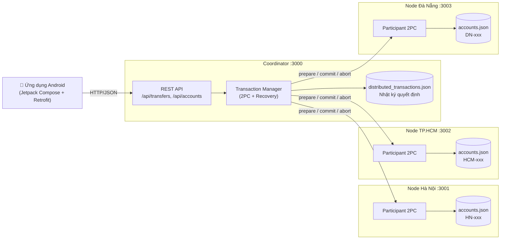
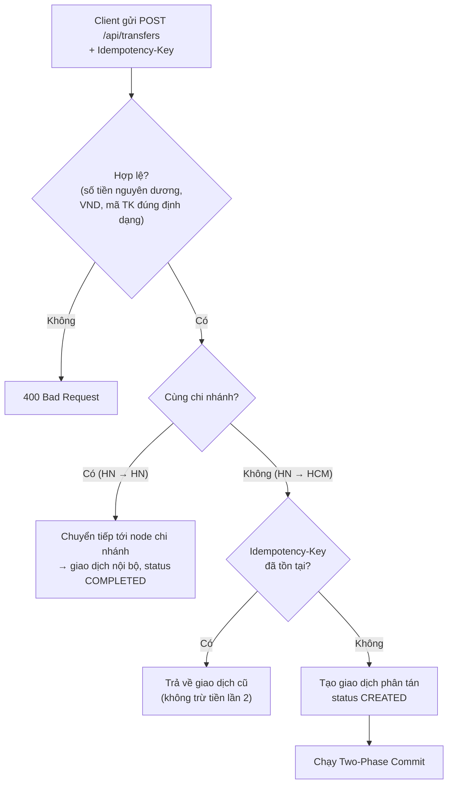
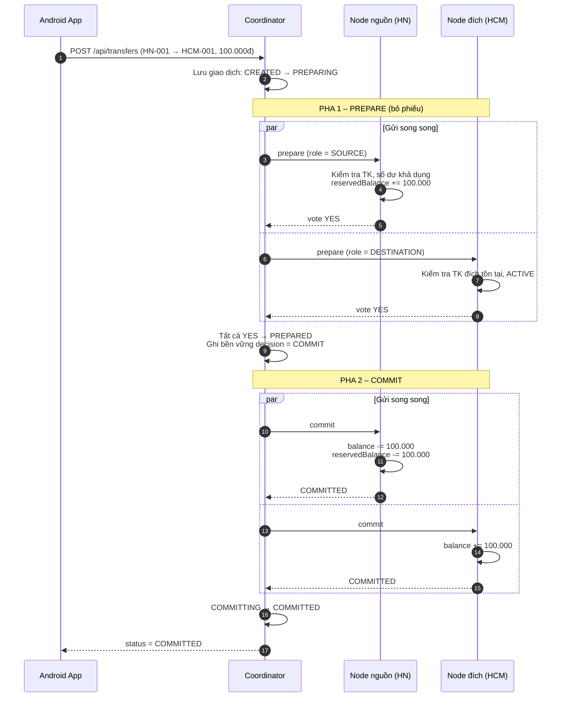
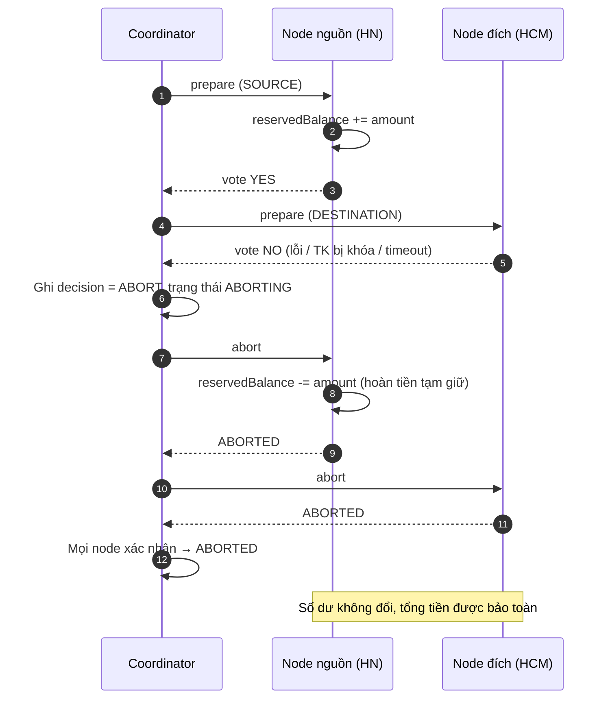
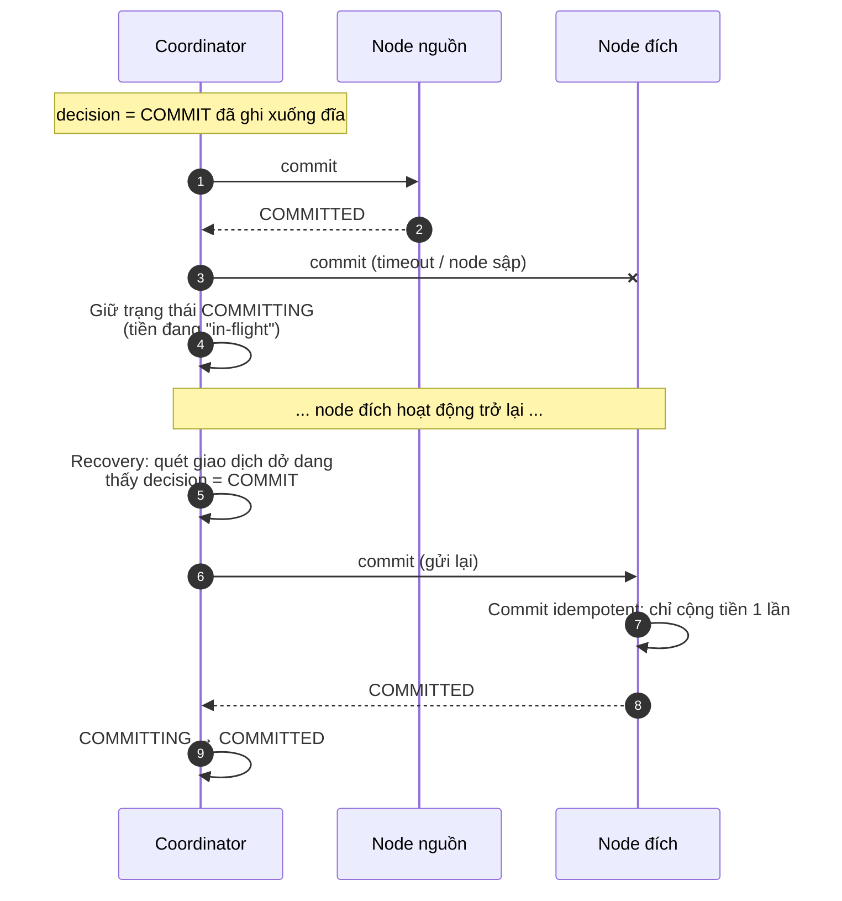
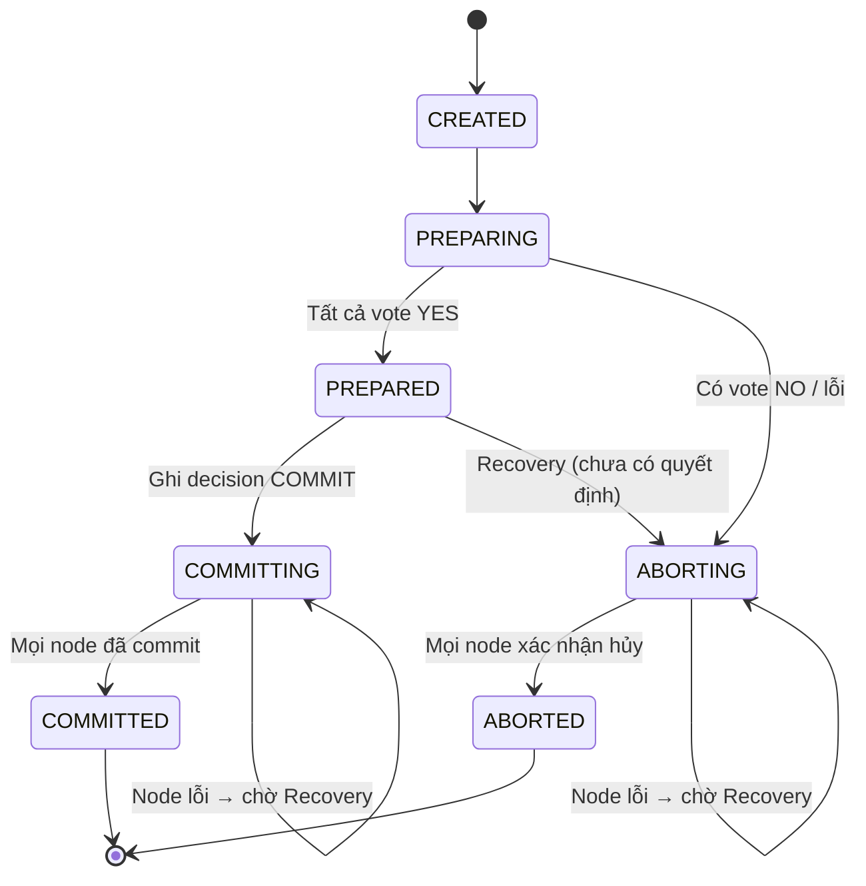

# Hỏi đáp: Kiến trúc phân tán của hệ thống chuyển tiền liên chi nhánh

Tài liệu trả lời các câu hỏi cốt lõi về thiết kế phân tán của dự án: vì sao cần phân tán,
phân tán ở đâu, giải pháp nào được chọn, kiến trúc và luồng xử lý, cùng các công nghệ –
thuật toán được sử dụng.

---

## 1. Tại sao hệ thống cần phân tán?

Một ngân hàng thực tế có nhiều chi nhánh ở các vùng địa lý khác nhau (Hà Nội, TP.HCM,
Đà Nẵng). Mỗi chi nhánh quản lý tài khoản của khách hàng thuộc chi nhánh mình. Nếu dồn
tất cả vào **một máy chủ, một cơ sở dữ liệu duy nhất** thì gặp các vấn đề:

| Vấn đề của hệ thống tập trung | Phân tán giải quyết như thế nào |
| --- | --- |
| **Điểm lỗi duy nhất (SPOF):** máy chủ trung tâm hỏng → toàn bộ ngân hàng ngừng hoạt động | Mỗi chi nhánh là một node độc lập; một chi nhánh gặp sự cố, các chi nhánh khác vẫn phục vụ giao dịch nội bộ |
| **Khả năng mở rộng kém:** mọi giao dịch đổ về một chỗ, tải tăng theo số chi nhánh | Tải được chia theo chi nhánh; thêm chi nhánh = thêm node |
| **Độ trễ:** khách ở xa phải truy cập máy chủ trung tâm | Dữ liệu nằm gần nơi phát sinh giao dịch |
| **Quyền sở hữu dữ liệu:** mỗi chi nhánh cần tự quản lý sổ sách của mình | Mỗi node sở hữu và chỉ tự sửa dữ liệu tài khoản của chi nhánh mình |

Tuy nhiên, khi dữ liệu bị chia ra nhiều nơi thì phát sinh bài toán khó nhất: **một giao
dịch chuyển tiền liên chi nhánh phải cập nhật dữ liệu ở hai node khác nhau**
(trừ tiền ở chi nhánh nguồn, cộng tiền ở chi nhánh đích). Nếu một bên thành công còn
bên kia thất bại (mất mạng, sập node), tiền sẽ **bị mất** hoặc **sinh ra từ hư không**.

> Mục tiêu của dự án chính là mô phỏng hệ thống phân tán này và chứng minh rằng
> **tổng tiền toàn hệ thống luôn được bảo toàn** kể cả khi có sự cố.

---

## 2. Hệ thống sẽ phân tán ở phần nào?

Hệ thống phân tán ở **tầng dữ liệu và tầng xử lý nghiệp vụ** của backend:

### 2.1. Phân vùng dữ liệu (Data Partitioning / Sharding)

Dữ liệu tài khoản được **phân vùng theo chi nhánh**, dựa trên tiền tố mã tài khoản:

| Tiền tố tài khoản | Node sở hữu | Cổng | Thư mục dữ liệu |
| --- | --- | --- | --- |
| `HN-xxx` | Node Hà Nội | 3001 | `backend/nodes/hn/data/` |
| `HCM-xxx` | Node TP.HCM | 3002 | `backend/nodes/hcm/data/` |
| `DN-xxx` | Node Đà Nẵng | 3003 | `backend/nodes/dn/data/` |

Mỗi node có **kho dữ liệu riêng**, không chia sẻ với node khác:
- `accounts.json` – số dư (`balance`) và tiền tạm giữ (`reservedBalance`)
- `transactions.json` – giao dịch nội bộ chi nhánh
- `participant_transactions.json` – trạng thái của node trong các giao dịch 2PC

### 2.2. Phân tán xử lý

- **Giao dịch nội bộ** (cùng chi nhánh, ví dụ `HN-001 → HN-002`): chỉ một node xử lý,
  không cần phối hợp.
- **Giao dịch liên chi nhánh** (ví dụ `HN-001 → HCM-001`): cần **hai node cùng tham gia**,
  được điều phối bởi **Coordinator** (cổng 3000) qua giao thức Two-Phase Commit.

### 2.3. Phần KHÔNG phân tán

- **Ứng dụng Android:** chỉ là client, gọi duy nhất tới Coordinator.
- **Coordinator:** chạy một bản duy nhất (đây là giới hạn đã biết – xem mục 5.4).

---

## 3. Giải pháp phân tán nhóm sử dụng là gì?

Nhóm sử dụng **giao thức cam kết hai pha – Two-Phase Commit (2PC)** để đảm bảo tính
**nguyên tử (atomicity)** cho giao dịch phân tán: hoặc **tất cả** các chi nhánh cùng thực
hiện, hoặc **không chi nhánh nào** thực hiện.

Kết hợp với 2PC là các cơ chế bổ trợ:

| Cơ chế | Vai trò |
| --- | --- |
| **Reservation (tạm giữ tiền)** | Ở pha Prepare, tiền ở tài khoản nguồn bị "khóa" vào `reservedBalance`, chưa trừ thật. Giao dịch khác không thể tiêu số tiền đang bị giữ |
| **Write-ahead decision log** | Coordinator ghi quyết định COMMIT/ABORT xuống đĩa **trước** khi gửi cho các node → sập giữa chừng vẫn biết phải làm gì |
| **Crash Recovery** | Khi Coordinator khởi động lại (hoặc gọi `POST /api/transfers/recover`), quét các giao dịch dở dang và hoàn tất chúng theo quyết định đã lưu; giao dịch chưa có quyết định thì **presumed abort** (mặc định hủy) |
| **Idempotency Key** | Mỗi yêu cầu chuyển tiền có header `Idempotency-Key`; gửi lại cùng key không làm trừ tiền hai lần |
| **Tombstone khi Abort** | Node nhận ABORT cho giao dịch chưa từng thấy sẽ ghi lại dấu "đã hủy", để một lệnh PREPARE đến muộn bị từ chối, tránh khóa tiền vĩnh viễn |
| **Chaos testing** | Chủ động tiêm lỗi (từ chối / timeout) ở pha Prepare hoặc Commit để kiểm chứng hệ thống chịu lỗi |

---

## 4. Mô hình kiến trúc và sơ đồ luồng

### 4.1. Kiến trúc tổng thể

**Các thành phần:**
- **Android App:** giao diện đăng nhập, xem tài khoản, chuyển tiền, lịch sử giao dịch,
  hiển thị trạng thái 2PC của từng chi nhánh.
- **Coordinator:** cổng vào duy nhất cho client; định tuyến theo tiền tố tài khoản;
  điều phối 2PC; lưu nhật ký giao dịch phân tán; chạy phục hồi khi khởi động.
- **Branch Node (HN/HCM/DN):** dùng chung mã nguồn `backend/shared/src`, khác nhau ở
  `BRANCH_ID`, cổng và thư mục dữ liệu. Mỗi node vừa xử lý giao dịch nội bộ, vừa đóng vai
  **participant** trong 2PC qua các endpoint nội bộ `/api/internal/transactions/:id/{prepare,commit,abort}`.

### 4.2. Luồng định tuyến yêu cầu chuyển tiền

### 4.3. Luồng 2PC – trường hợp thành công

### 4.4. Luồng 2PC – có chi nhánh từ chối (ABORT)

### 4.5. Luồng phục hồi khi lỗi ở pha Commit

### 4.6. Máy trạng thái của giao dịch phân tán (tại Coordinator)

**Quy tắc bất biến:** một khi đã ghi `decision = COMMIT` thì **không bao giờ** được ABORT;
ngược lại đã `ABORT` thì không bao giờ được COMMIT.

---

## 5. Công nghệ, thuật toán sử dụng – tại sao và phục vụ mục đích gì

### 5.1. Công nghệ

| Công nghệ | Dùng ở đâu | Tại sao chọn | Mục đích |
| --- | --- | --- | --- |
| **Node.js** | Coordinator + 3 node | Mô hình I/O bất đồng bộ, phù hợp gửi nhiều request mạng song song (prepare/commit tới các node); dễ chạy nhiều tiến trình trên một máy để mô phỏng | Chạy các tiến trình phân tán độc lập |
| **Express.js** | REST API | Nhẹ, đơn giản, phổ biến | Định nghĩa API công khai và API nội bộ 2PC |
| **Axios** | Coordinator → node | Hỗ trợ `timeout`, xử lý lỗi rõ ràng (phân biệt node trả lỗi / từ chối kết nối / timeout) | Giao tiếp giữa các node qua HTTP, phát hiện node lỗi |
| **File JSON** (ghi nguyên tử: file tạm + `rename`) | Lưu trữ mỗi node | Dễ quan sát, dễ reset khi demo; ghi nguyên tử đảm bảo file không bị hỏng khi sập giữa chừng | Lưu trữ bền vững (durable) trạng thái và nhật ký |
| **UUID** | Mã giao dịch | Sinh ID duy nhất toàn cục mà không cần cơ quan cấp phát trung tâm | Định danh giao dịch giữa các node |
| **concurrently** | Script khởi động | Chạy 4 tiến trình bằng một lệnh | Thuận tiện khi demo |
| **Kotlin + Jetpack Compose** | Ứng dụng Android | Bộ công cụ UI hiện đại, khai báo, chính thức của Android | Giao diện người dùng |
| **Retrofit + OkHttp + kotlinx.serialization** | Android gọi API | Chuẩn phổ biến, hỗ trợ coroutine, timeout, log | Kết nối app với Coordinator |
| **MVVM (ViewModel + StateFlow)** | Android | Tách UI khỏi logic, quản lý trạng thái giao dịch (Loading / Success / Aborted / Pending) | Hiển thị trạng thái 2PC rõ ràng cho người dùng |

### 5.2. Thuật toán và kỹ thuật

#### a) Two-Phase Commit (2PC)
- **Là gì:** giao thức đồng thuận nguyên tử gồm pha **Prepare** (hỏi ý kiến – bỏ phiếu)
  và pha **Commit/Abort** (thực thi quyết định chung).
- **Tại sao:** giao dịch liên chi nhánh chạm vào hai kho dữ liệu độc lập; không có
  "transaction" chung của một database nào bao trùm cả hai. 2PC là giải pháp kinh điển,
  dễ hiểu, đảm bảo tính nhất quán mạnh.
- **Mục đích:** đảm bảo **atomicity** – hoặc cả hai chi nhánh cùng cập nhật, hoặc không ai
  cập nhật → không mất tiền, không sinh tiền.

#### b) Reservation (tạm giữ tiền) ở pha Prepare
- **Là gì:** thay vì trừ tiền ngay, node nguồn tăng `reservedBalance`.
  Số dư khả dụng = `balance − reservedBalance`.
- **Tại sao:** nếu trừ thật ngay ở Prepare mà sau đó phải ABORT thì phải "bù trừ" phức tạp;
  còn nếu không giữ thì giao dịch khác có thể tiêu mất số tiền đã hứa.
- **Mục đích:** node nguồn **cam kết chắc chắn** có thể trả tiền khi nhận COMMIT, đồng
  thời ABORT chỉ cần nhả phần tạm giữ.

#### c) Ghi quyết định trước khi thực thi (Write-Ahead Decision)
- **Là gì:** Coordinator ghi `decision = COMMIT/ABORT` xuống đĩa trước khi gửi pha 2.
- **Mục đích:** nếu Coordinator sập ngay sau đó, khi khởi động lại vẫn biết chính xác
  phải tiếp tục COMMIT hay ABORT – không bao giờ đưa ra hai quyết định khác nhau.

#### d) Crash Recovery + Presumed Abort
- **Là gì:** khi khởi động (sau 5 giây) hoặc khi gọi API recover, Coordinator quét các
  giao dịch chưa ở trạng thái cuối:
  - Đã có `decision = COMMIT` → gửi lại COMMIT cho tới khi mọi node xác nhận.
  - Đã có `decision = ABORT` → gửi lại ABORT.
  - Chưa có quyết định → **mặc định ABORT** (an toàn vì chắc chắn chưa node nào commit).
- **Mục đích:** hệ thống **tự hội tụ** về trạng thái nhất quán sau sự cố; không để tiền
  bị khóa vĩnh viễn.

#### e) Idempotency (tính lũy đẳng)
- **Là gì:**
  - Ở tầng client: header `Idempotency-Key`; cùng key → trả lại giao dịch cũ.
  - Ở tầng 2PC: `prepare`, `commit`, `abort` gọi lặp lại nhiều lần cho kết quả như một
    lần (commit lần 2 trả `ALREADY_COMMITTED`, không cộng tiền lần nữa).
- **Tại sao:** trong mạng, timeout không có nghĩa là thất bại – request có thể đã được
  xử lý. Client và Coordinator buộc phải **gửi lại**.
- **Mục đích:** cho phép retry an toàn, **không trừ/cộng tiền hai lần**.

#### f) Máy trạng thái (State Machine) có kiểm soát chuyển trạng thái
- **Là gì:** bảng `ValidTransitions` quy định trạng thái nào được chuyển sang trạng thái nào.
- **Mục đích:** chặn các chuyển đổi sai, ví dụ ABORT một giao dịch đã COMMITTED
  (`CRITICAL_2PC_VIOLATION`).

#### g) Phát hiện lỗi bằng Timeout
- **Là gì:** Coordinator đặt timeout 5 giây cho prepare/commit, 2 giây cho abort.
- **Mục đích:** không chờ vô hạn một node đã chết; phân biệt lỗi chắc chắn (node trả lỗi,
  từ chối kết nối → chắc chắn chưa prepare) với lỗi mơ hồ (timeout → có thể đã prepare,
  phải chờ node xác nhận ABORT).

#### h) Chaos Engineering (tiêm lỗi chủ động)
- **Là gì:** API `/api/chaos` trên mỗi node cho phép bật lỗi `REJECT` hoặc `TIMEOUT` tại
  điểm `PREPARE` hoặc `COMMIT`.
- **Mục đích:** chứng minh bằng thực nghiệm rằng hệ thống chịu lỗi; kịch bản kiểm thử
  (`chaos_test.js`, `recovery_test.js`, `demo_viva.js`) luôn kiểm tra **bảo toàn tổng
  tiền = 80.000.000 VND**.

### 5.3. Tóm tắt: thuật toán nào giải quyết vấn đề nào

| Vấn đề của hệ phân tán | Giải pháp trong dự án |
| --- | --- |
| Cập nhật hai node phải cùng thành công hoặc cùng thất bại | Two-Phase Commit |
| Tiền đã hứa chuyển bị tiêu bởi giao dịch khác | Reservation (`reservedBalance`) |
| Coordinator sập giữa chừng | Ghi quyết định bền vững + Crash Recovery |
| Node sập / mạng chậm | Timeout + trạng thái COMMITTING/ABORTING + Recovery |
| Request bị gửi lặp do retry | Idempotency Key + thao tác 2PC idempotent |
| PREPARE đến muộn sau ABORT | Tombstone – node từ chối PREPARE muộn |
| File dữ liệu hỏng khi sập lúc đang ghi | Ghi nguyên tử (file tạm + rename) |
| Chứng minh hệ thống đúng | Chaos testing + kiểm tra bảo toàn tiền |

### 5.4. Giới hạn đã biết và hướng phát triển

- **2PC là giao thức "blocking":** nếu Coordinator sập sau khi các node đã PREPARED, tiền
  ở node nguồn bị tạm giữ cho tới khi Coordinator phục hồi. Hướng cải tiến: **Three-Phase
  Commit**, hoặc nhân bản Coordinator bằng **Raft/Paxos**.
- **Coordinator là điểm lỗi đơn:** chỉ có một bản. Hướng cải tiến: nhiều Coordinator có
  bầu leader.
- **Lưu trữ bằng file JSON:** phục vụ mục đích học tập/demo. Thực tế nên dùng CSDL có
  transaction (PostgreSQL) cho từng chi nhánh.
- **Phương án thay thế 2PC:** mẫu **Saga** (chuỗi giao dịch cục bộ + giao dịch bù trừ) –
  không blocking, nhưng chỉ đạt nhất quán cuối cùng (eventual consistency), ít phù hợp
  khi cần minh họa nhất quán mạnh cho nghiệp vụ chuyển tiền.
- **Bảo mật:** API nội bộ (`/api/internal`) và API chaos chưa có xác thực; chỉ dùng trong
  môi trường demo.
